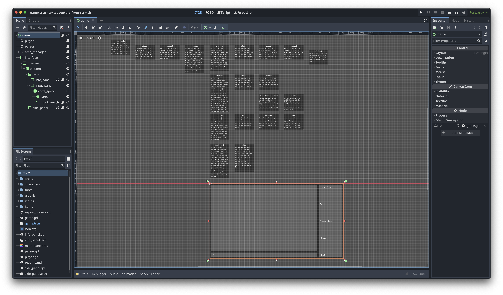
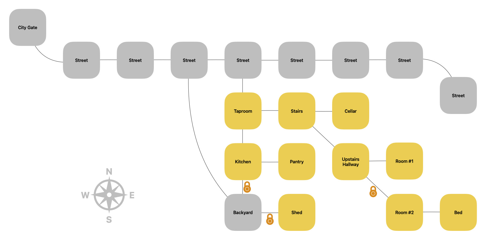

Here's a little walk through, showing how to finish the mini adventure with the least amount of moves (currently 30):

- `go alley`
- `go east`
- `go inn`
- `go kitchen`
- `take backdoorkey`
- `go pantry`
- `take shedkey`
- `go kitchen`
- `use backdoorkey`
- `go backyard`
- `use shedkey`
- `go shed`
- `take sword`
- `go backyard`
- `go alley`
- `go west`
- `go west`
- `go west`
- `give sword`
- `go east`
- `go east`
- `go east`
- `go east`
- `go inn`
- `give coins`
- `go stairs`
- `go up`
- `use roomkey`
- `go right`
- `go bed`

Also, here's a map of the area:

